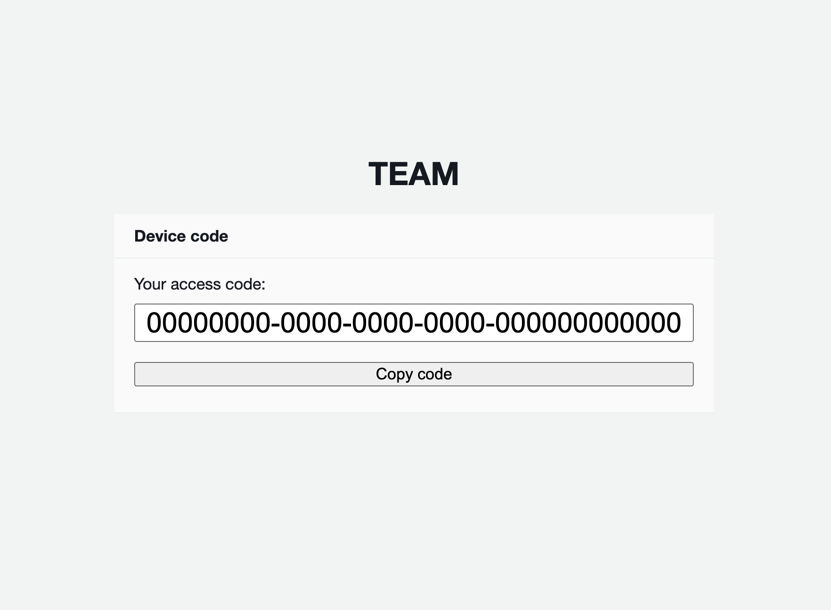

# team-cli
Command line interface for [AWS Temporary elevated access management (TEAM)](https://aws-samples.github.io/iam-identity-center-team/).

### Install

Install command:

```bash
go install github.com/csnewman/team-cli/cmd/team-cli@latest
```

Configure remote server:
```
team-cli configure team.your-company.com
```

### Usage

The tool caches its authentication token automatically. Once expired, any of the following commands will prompt you to
reauthenticate.

List accounts:
```
$ team-cli list-accounts

Accounts:
  [1] id="123123123123" name="example"
    - role="ReadOnlyAccess" max_duration=8 requires_approval=false
```

Request access interactively:
```
$ team-cli request

Please select the account:
  [1] id="123123123123" name="example"

Account option? 
```

Request access non-interactively:
```
$ team-cli request --account "example" --role="readonlyaccess" --duration 3 --ticket "support-123" --reason "Demo" --start "now" -y

Details:
  Account: id="123123123123" name="example"
  Role: name="ReadOnlyAccess"
  Start: now
  Ticket: "support-123"
  Justification: "Demo"

Request submitted
Request ID: 00000000-0000-0000-0000-000000000000
```

Respond to requests interactively:
```
$ team-cli respond

Please select the request:
  [1] requester="example@example.com" account="example" role="ReadOnlyAccess"
        account_id="123123123123" requested="Tue Nov 11 20:00:00 GMT 2025" start_time="Tue Nov 11 20:00:00 GMT 2025" duration="1 hours" 
        ticket="demo-123" justification="Demo example"

Request option? 1

Please select the response:
  [1] Approve
  [2] Approve without comment
  [3] Reject
  [4] Reject without comment

Response option?
```


### TEAM install configuration

The default cognito client app does not allow localhost redirects upon successful authentication. `team-cli` requires
it's callback address to be added to the allowed list to be able to fetch authentication tokens.

#### Via web UI:

Add `http://localhost:43672/` to the `team06dbb7fc_app_clientWeb` app client in the Cognito `team` user pool.


#### Optional: Device code support

Optionally, you can enable "Device code" support. This allows you to use team-cli on a device without a GUI.

1. Edit `deployment/template.yml` in your `iam-identity-center-team` fork, adding in:
    
    ```yaml
    - Source: /device_code/
      Status: 200
      Target: /device_code.html
    ```
    to `Resources.AmplifyApp.Properies.CustomRules` (around line 77), as the first rule.
 
    It will look similar to:

    ```yaml
    # ...
    Description: Temporary Elevated Access Management Application
    CustomRules:
    - Source: /device_code/
      Status: 200
      Target: /device_code.html
    - Source: /<*>
      Status: 404
      Target: /index.html
    # ...
    ```

2. Copy `device_code.html` & `device_code.js` from the root of this repo to `public/`.

3. Trigger a redeployment of TEAM and wait for it to complete (including executing `./deploy.sh` to apply the new rule).

4. Test device code auth: `team-cli configure team.your-company.com --device-code` 
   

5. Paste the code into the team-cli prompt.
